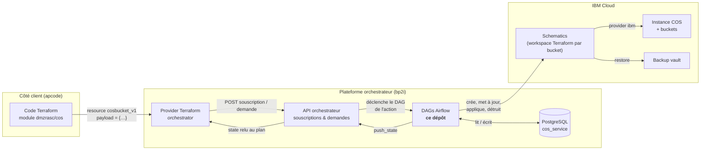
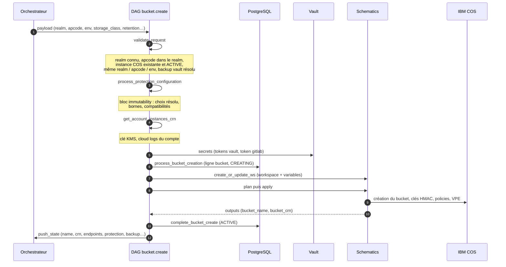
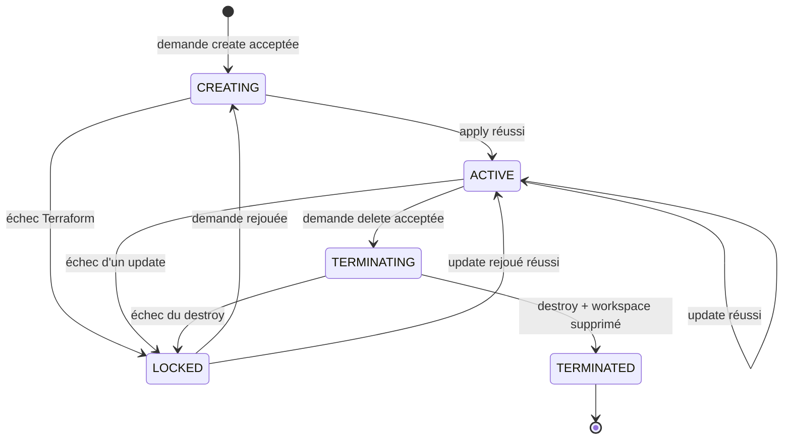
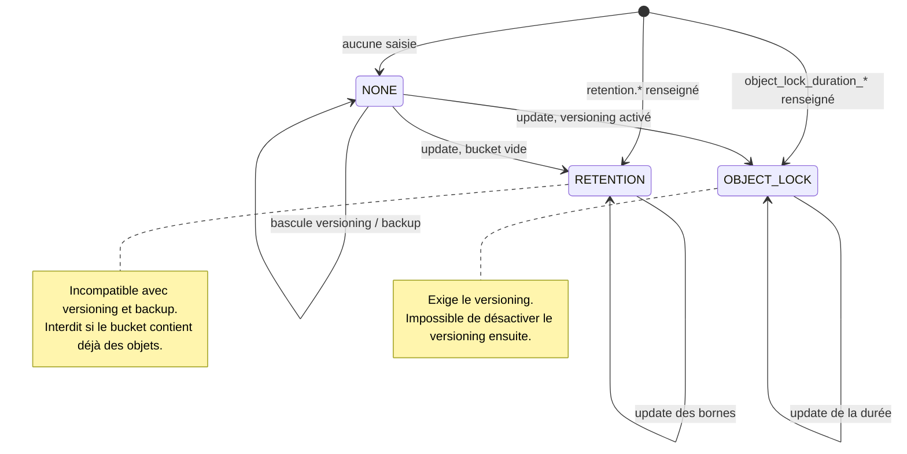
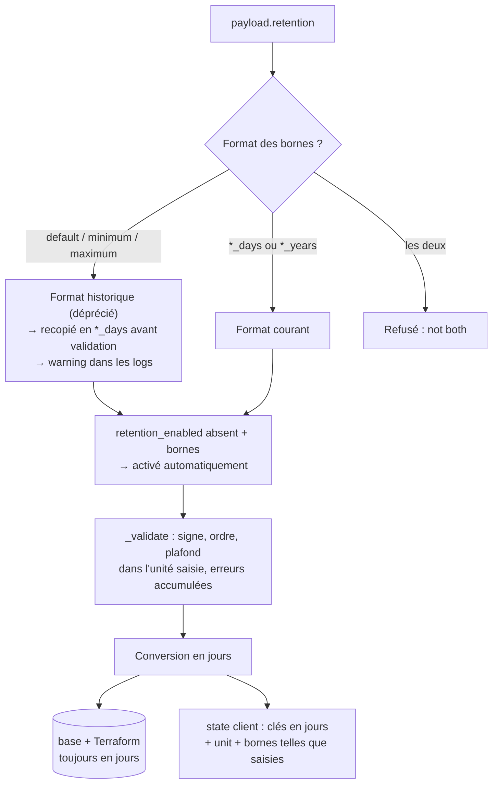

# Produit COS – Cloud Object Storage en libre-service

`cos` est le code métier du produit **COS** (IBM Cloud Object Storage) de la Market Place.
C'est un ensemble de DAGs Airflow qui reçoivent des demandes de l'orchestrateur, les
valident, pilotent Terraform via IBM Schematics et gardent la trace de chaque bucket en
base PostgreSQL.

Ce README explique **comment le projet fonctionne de bout en bout**. Il s'adresse à
quelqu'un qui découvre le produit : un nouveau développeur, un ops, un client curieux.
Les détails de chaque couche sont dans les documents liés en fin de page.

---

## 1. Le produit en une image

Un client ne voit jamais Airflow. Il écrit quelques lignes de Terraform, et un bucket
apparaît dans son compte IBM Cloud, avec les protections qu'il a demandées.



Trois idées à retenir :

- **Le contrat client est le `payload`** de la ressource `orchestrator_subscription_cosbucket_v1`.
  Le module et le provider le transportent sans l'interpréter. C'est le DAG, avec ses schémas
  Pydantic, qui le valide.
- **Le `v1`** dans `cos.bucket.v1.create` et dans `cosbucket_v1` est le même numéro de contrat.
  Tant que les changements sont additifs, on reste en `v1`.
- **Le state** poussé par le DAG est ce que le client relit à chaque `terraform plan`.
  Renommer une clé du state fait dériver le plan de tous les clients existants.

## 2. Les concepts

| Terme | Ce que c'est | Où on le voit dans le code |
|---|---|---|
| **Souscription** | Une ressource gérée par l'orchestrateur : une instance COS, un bucket, un backup vault. Elle a un `subscription_id`, un statut et un state | `payload.subscription_id`, `state_manager` |
| **Demande** | Une action sur une souscription : `create`, `update`, `delete`, `restore`… Chaque demande exécute un DAG | Un fichier par action dans `cos_service/dags/` |
| **DAG** | Un enchaînement d'étapes Python (`@step`) décoré par `@product_action` | `cos.bucket.v1.<action>.py` |
| **State** | Les données de la souscription renvoyées au client (nom, CRN, endpoints, protection…) | `state_manager.push_state({...})` |
| **Workspace** | L'espace Schematics qui porte le Terraform et le `tfstate` d'un bucket | `ws_bucket_<subscription_id>` |
| **Payload** | Ce que le client a envoyé, validé par un schéma Pydantic | `BucketCreatePayload`, `BucketRetention`, `BucketBackup` |
| **Décliner** | Refuser une demande avec un message lisible, sans rien créer | `DeclineDemandException` |

## 3. Anatomie d'un DAG

Tous les DAGs suivent le même squelette, fourni par `bp2i_airflow_library` :

```python
class BucketCreatePayload(ProductCreatePayload):
    storage_class: StorageClass
    retention: BucketRetention | None = Field(updatable=True)
    backup: BucketBackup | None = Field(updatable=True)
    ...

@product_action(Path(__file__).stem, tags=["cos"], payload=BucketCreatePayload)
def bucket_create():

    @step
    def validate_request(
        payload: BucketCreatePayload = depends(payload_dependency),
        session: SASession = depends(sqlalchemy_session_dependency),
    ) -> dict:
        errors = []
        ...                                # on accumule
        if errors:
            raise DeclineDemandException(" | ".join(errors))   # une seule réponse au client
        return {...}                       # passé à l'étape suivante

    @step
    def create_tf_workspace(validated: dict, tf: SchematicsBackend = depends(...)) -> str:
        ...

    validated = validate_request()
    workspace_id = create_tf_workspace(validated=validated)   # câblage des étapes
```

Ce qu'il faut savoir :

- **`@product_action`** enregistre le DAG sous le nom du fichier (`cos.bucket.v1.create`) et lui
  associe son schéma de payload. Le nom du fichier est donc le nom de l'action.
- **`@step`** transforme chaque fonction en tâche Airflow. La valeur renvoyée est transmise
  aux étapes suivantes via leurs arguments.
- **`depends(...)`** injecte les dépendances : payload validé, session SQL, backend Schematics,
  Vault, `state_manager`. Les étapes ne construisent jamais ces objets elles-mêmes.
- **Une seule étape de validation en tête**, qui accumule toutes les erreurs et décline en une
  fois. Le client ne découvre pas ses erreurs une par une.
- **En cas d'échec Terraform**, la souscription passe en `LOCKED` et le workspace en `FAILED`.
  La demande est rejouable : le workspace existant est réutilisé, pas recréé.

## 4. Les actions sur un bucket

| Action | DAG | Ce qu'elle fait |
|---|---|---|
| Créer | `cos.bucket.v1.create` | Valide, calcule la protection, crée le workspace, `plan` + `apply`, enregistre |
| Mettre à jour | `cos.bucket.v1.update` | Change la protection, le versioning, le backup ou les permissions, planifiable à une date |
| Supprimer | `cos.bucket.v1.delete` | Détruit les ressources Terraform, puis le workspace, puis marque `TERMINATED` |
| Restaurer | `cos.bucket.v1.restore` | Restaure le contenu depuis un backup vault, à un point dans le temps choisi |
| Nettoyer | `cos.bucket.v1.clean`, `force_clean` | Vide un bucket via une règle d'expiration S3 |
| Règles de cycle de vie | `create/update/delete_lifecycle_policy_rule` | Gère les règles d'expiration du bucket |
| Recovery ranges | `refresh_restore_ranges` | Rafraîchit les fenêtres de restauration disponibles |

### 4.1 Créer un bucket



Les variables envoyées au workspace sont calculées par le DAG à partir du payload, du realm
et des instances du compte : CRN de l'instance COS, clé KMS, adresses et tokens Vault,
bloc de rétention en jours, object lock, backup, classe de stockage, type de cloud selon la
région. Le détail est dans [`terraform/README.md`](terraform/README.md).

### 4.2 Mettre à jour, supprimer, restaurer

```mermaid
flowchart TB
    subgraph U["update"]
        U1["validate_request<br/>bucket existant, contenu, vault,<br/>règles de protection vs état actuel"] --> U2["compute_target_time<br/>date planifiée (défaut : maintenant)"]
        U2 --> U3["update_tf_workspace<br/>variables puis plan + apply"]
        U3 --> U4["save_bucket_in_db<br/>+ push_state"]
    end
    subgraph Dl["delete"]
        D1["validate_request<br/>bucket vide, workspace connu<br/>→ TERMINATING"] --> D2["destroy_tf_resources<br/>terraform destroy"]
        D2 --> D3["update_db_for_resources"]
        D3 --> D4["destroy_tf_workspace<br/>404 Schematics toléré"]
        D4 --> D5["update_db_for_workspace<br/>→ TERMINATED"]
    end
    subgraph R["restore"]
        R1["input_user_validation<br/>bucket cible, apcode, realm,<br/>restore_point_in_time"] --> R2["get_wklapp_iam_token"]
        R2 --> R3["validate_backup_vault"]
        R3 --> R4["select_recovery_range<br/>le range qui contient le point"]
        R4 --> R5["create_tf_workspace_and_launch_restore"]
    end
```



Points notables :

- **Update** : la règle est "la saisie remplace, l'absence conserve". Un client qui n'envoie
  que `maximum_years = 5` garde ses autres bornes. La validation compare la demande à l'état
  réel du bucket, reconstruit depuis la base.
- **Delete** : un bucket qui contient encore des objets est refusé. La suppression du
  workspace tolère un `404` de Schematics, pour rejouer une suppression à moitié faite.
- **Restore** : le client choisit un point dans le temps. Le DAG cherche le recovery range
  qui le contient (`recovery_range_service`), et refuse avec la liste des fenêtres disponibles
  si aucun ne convient.

## 5. Cycle de vie d'un bucket



`LOCKED` n'est jamais un état final : c'est "quelque chose a échoué, la ligne en base et le
workspace sont conservés pour rejouer". Le statut du workspace (`in_progress`, `success`,
`failed`) est suivi séparément du statut de la souscription.

## 6. La protection des données

Trois modes exclusifs, décidés à la création puis contraints à la mise à jour. Toute la
logique est dans `immutability_service.py`, utilisé par les DAGs `create` et `update`.



| Mode | Ce que ça fait | Contraintes |
|---|---|---|
| **Rétention** | Chaque objet est gelé pendant une durée entre `minimum` et `maximum`, `default` s'appliquant si l'objet n'en précise pas | Pas de versioning, pas de backup, bucket vide |
| **Object lock** | Verrou WORM sur les versions d'objets pendant `object_lock_duration_days` ou `_years` | Versioning obligatoire, irréversible |
| **Aucun** | Bucket classique | Versioning et backup libres |

Le **backup** copie les versions d'objets vers un backup vault (souscription à part, module
`terraform/v1.12/backup_vault`). Il exige le versioning, et un `backup_retention_days` pour
la durée de conservation dans le vault.

### 6.1 Rétention : jours ou années, sans casser les clients

Les bornes se saisissent dans une unité explicite, `*_days` ou `*_years`, une seule par
demande. Le plafond est de cinq ans, comparé dans l'unité saisie. L'ancien format sans
suffixe, en jours implicites, reste accepté et est traduit avant validation ; il est déprécié.



Pourquoi pas une `v2` : ajouter une unité est additif pour le client. Une `v2` aurait imposé
une migration de ressource Terraform à chacun, pour un gain nul. La décision et ses points
ouverts sont dans [`docs/adr/0001-retention-unites-jours-annees.md`](docs/adr/0001-retention-unites-jours-annees.md).

## 7. Exemples de payloads

Ce que le client met dans le bloc `payload` de sa ressource `cosbucket_v1`.

**Bucket simple, sans protection**

```hcl
payload = {
  storage_class = "standard"
  cos_instance  = "co21000001"
}
```

**Rétention en années** (le drapeau est déduit des bornes)

```hcl
payload = {
  storage_class      = "standard"
  cos_instance       = "co21000001"
  retention          = { default_years = 2, minimum_years = 1, maximum_years = 5 }
  immutability_choice = "retention_yearly"
}
```

**Rétention à l'ancien format** (toujours accepté, déprécié)

```hcl
retention = { retention_enabled = true, default = 30, minimum = 1, maximum = 90 }
```

**Object lock avec versioning et backup**

```hcl
payload = {
  storage_class             = "vault"
  cos_instance              = "co21000001"
  enable_versioning         = true
  object_lock_duration_days = 30
  backup = {
    backup_enabled        = true
    backup_vault_name     = "bv-app-prod"
    backup_retention_days = 7
  }
}
```

**Mise à jour d'une seule borne, planifiée**

```hcl
payload = {
  retention                    = { maximum_years = 5 }
  scheduling_update_date_time  = "2026-10-01T02:00:00"
}
```

**Restauration à un point dans le temps**

```hcl
payload = {
  backup_vault_name     = "bv-app-prod"
  target_bucket         = "app-prod-bucket-restored"
  app_code              = "AP85133"
  realm                 = "realm-xyz"
  restore_point_in_time = "2026-09-15T10:30:00Z"
}
```

Ce que le client relit dans le state après une création :

```json
{
  "name": "ap85133-prod-data-a1b2c3",
  "crn": "crn:v1:bluemix:public:cloud-object-storage:global:a/...:bucket:...",
  "virtual_server_endpoint": { "host_style": "https://…s3.direct.eu-de.cloud-object-storage.appdomain.cloud" },
  "storage_class": "standard",
  "immutability_choice": "retention_yearly",
  "retention": { "retention_enabled": true, "default": 730, "minimum": 365, "maximum": 1826,
                 "unit": "years", "default_years": 2, "minimum_years": 1, "maximum_years": 5 },
  "enable_versioning": false,
  "backup": { "backup_enabled": false, "backup_vault_sub_id": null, "backup_retention_days": null }
}
```

## 8. Terraform et Schematics

Le projet n'appelle jamais l'API IBM COS pour créer un bucket. Il écrit des variables et
délègue à **IBM Schematics**, le Terraform managé d'IBM Cloud. Chaque bucket a son propre
workspace, qui garde son `tfstate`.

- `terraform/v1.12/bucket/main.tf` est le module racine d'un bucket : naming, Vault,
  service ID IAM, le module `terraform-module-cos` (surcouche BNP du module IBM), le binding
  VPE, l'écriture des clés HMAC dans Vault.
- `terraform/v1.12/backup_vault/main.tf` crée un backup vault.
- `schematics_service.py` est générique : créer ou mettre à jour un workspace, changer ses
  variables, lancer `plan` + `apply`. La branche Terraform suivie dépend de l'environnement
  (`int`, `pprod`, `prod`), surchargeable par variable d'environnement.

Chaîne complète, versions des modules, provenance de chaque variable et points d'attention :
[`terraform/README.md`](terraform/README.md).

## 9. Ce qui est en base

`bucketService.py` porte la persistance SQLAlchemy et les appels S3 directs.

| Table | Contenu | Remarques |
|---|---|---|
| `bucket` | Une ligne par souscription bucket : nom, CRN, classe, région, `retention_*` en jours, object lock, versioning, backup, statuts | Relations vers `cos`, `workspace`, `backup_vault` |
| `workspace` | Le workspace Schematics du bucket : id, statut (`in_progress`, `success`, `failed`), dernière action (`apply`, `destroy`) | Réutilisé lors des rejeux |
| `cos` | Les instances COS : nom, CRN, contexte (realm, apcode, compte) | Un bucket appartient à une instance |
| `backup_vault` | Les coffres de sauvegarde et leurs restaurations | Statut de restauration `requested`, `running`, `complete`, `failed` |

Le jour est l'unité canonique de la base pour la rétention. Le service appelle aussi
directement le endpoint S3 du bucket pour savoir s'il contient des objets, si le versioning
ou l'object lock sont actifs, et pour poser ou retirer une règle de nettoyage.

## 10. Outils

`cos-subscriptions/subscriptions_cleanup.py` nettoie les souscriptions de test côté
orchestrateur : liste paginée, filtre par produit et utilisateur, suppression des
souscriptions éligibles ou relance des demandes de suppression en erreur, et un mode
`--on-error` qui décline les demandes bloquées. Dry-run par défaut, `--delete` ou `--decline`
pour agir. Le mode d'emploi complet est dans l'en-tête du script.

## 11. Organisation du dépôt

```
cos_service/
├── dags/
│   ├── bucket/v1/          cos.bucket.v1.{create,update,delete,restore,clean,…}.py
│   ├── cos/                instances COS
│   ├── backup_vault/       coffres de sauvegarde
│   └── bucket_migration/   migration entre instances
├── schemas/                payloads Pydantic : BucketRetention, BucketBackup, Immutability…
├── services/
│   ├── immutability_service.py    règles de protection (création et mise à jour)
│   ├── bucketService.py           persistance des buckets et appels S3
│   ├── schematics_service.py      workspaces Terraform
│   ├── recovery_range_service.py  choix du point de restauration
│   └── vault_service.py           secrets
├── models/ repository/     SQLAlchemy
└── sql/                    scripts de schéma
terraform/                  Terraform exécuté par Schematics (bucket, backup vault) + README
cos-subscriptions/          script de nettoyage des souscriptions
tests/                      tests unitaires exécutables hors plateforme
docs/adr/                   décisions d'architecture
```

`STRUCTURE.md` détaille l'arborescence telle que reconstituée depuis le projet d'origine.

## 12. Développer et tester

Les tests tournent **sans** Airflow, sans `bp2i_airflow_library` et sans IBM : un
`conftest.py` installe des doublures pour l'infrastructure et pour les schémas absents du
dépôt. Les services et les étapes de DAG testés sont toujours le vrai code.

```bash
pip install -r requirements-test.txt
python -m pytest                 # unitaires
python -m pytest --cov           # avec couverture
```

Ce que la suite couvre :

- chaque étape des DAGs `create`, `update`, `delete`, `restore`, appelée directement avec des
  services simulés ;
- les services : protection des données, persistance, Schematics, recovery ranges ;
- le contrat de rétention : les deux formats, unités, bornes, activation automatique, écho
  dans le state ;
- le script de nettoyage.

Deux conventions à connaître : la date du jour est figée dans les tests (les conversions
années → jours comptent les 29 février) ; et un test marqué `integration` exige le venv
complet avec la vraie librairie. Tout est décrit dans [`tests/README.md`](tests/README.md).

## 13. Documentation associée

| Document | Sujet |
|---|---|
| [`terraform/README.md`](terraform/README.md) | Chaîne DAG → Schematics → modules, variables, versions, points d'attention |
| [`tests/README.md`](tests/README.md) | Harnais de test, doublures, fixtures |
| [`docs/adr/0001-retention-unites-jours-annees.md`](docs/adr/0001-retention-unites-jours-annees.md) | Rétention jours/années sans rupture du contrat v1 |
| `STRUCTURE.md` | Arborescence du projet d'origine |

## 14. Glossaire

| Terme | Signification |
|---|---|
| **apcode** | Code application BNPP, propriétaire de la ressource |
| **realm** | Périmètre de comptes IBM Cloud ; un apcode appartient à un realm |
| **CRN** | Cloud Resource Name IBM, identifiant unique d'une ressource cloud |
| **Schematics** | Service IBM qui exécute du Terraform dans un workspace hébergé |
| **KMS** | Key Management Service, la clé qui chiffre le bucket |
| **VPE** | Virtual Private Endpoint, accès privé au bucket depuis le réseau BNPP |
| **HMAC** | Paire de clés d'accès S3, stockée dans Vault pour l'application |
| **Backup vault** | Coffre IBM qui reçoit les copies de sauvegarde d'un bucket versionné |
| **Recovery range** | Fenêtre de temps sur laquelle un backup vault peut restaurer |
| **Immutabilité** | Terme générique du produit pour rétention et object lock |
