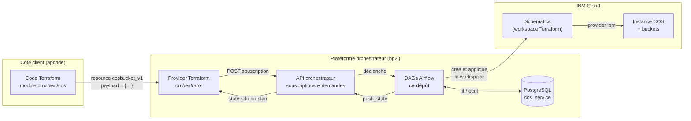
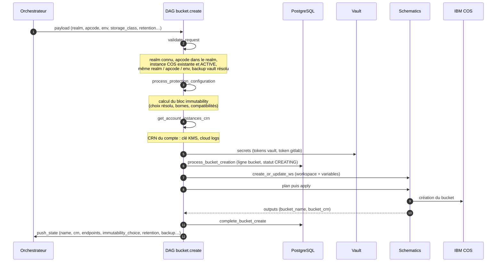
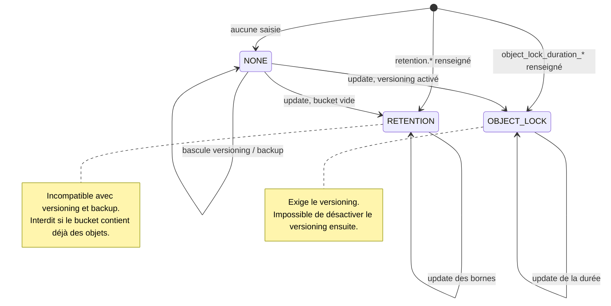
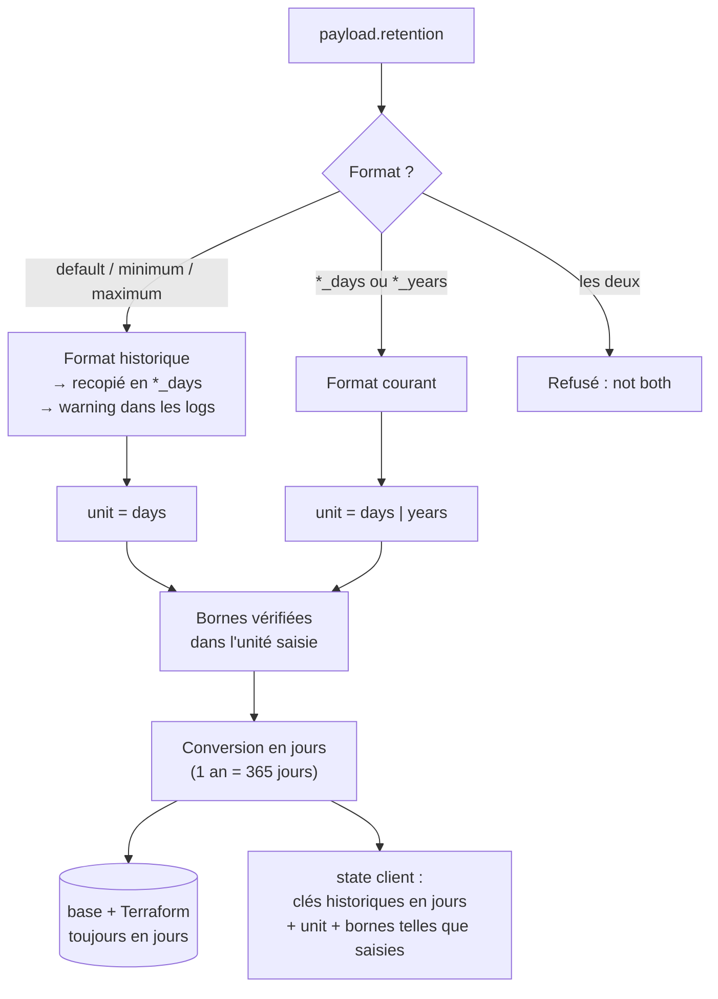

# Produit COS – Cloud Object Storage en libre-service

Ce dépôt contient la logique métier du produit **COS** (Cloud Object Storage IBM) de la
Market Place : un ensemble de DAGs Airflow qui reçoivent des demandes de l'orchestrateur,
les valident, pilotent Terraform via IBM Schematics et gardent la trace de chaque bucket
en base PostgreSQL.

Ce README est pensé pour être lu en dix minutes par quelqu'un qui découvre le produit :
un client, un ops, un nouveau développeur. Le détail des fonctions est dans le code.

---

## 1. Le produit en une image

Un client ne voit jamais Airflow. Il écrit quelques lignes de Terraform, et un bucket
apparaît dans son compte IBM Cloud avec les protections demandées.



Points à retenir :

- **Le contrat client est le `payload`** de la ressource `orchestrator_subscription_cosbucket_v1`.
  Le module et le provider ne font que le transporter. C'est le DAG, avec son schéma
  Pydantic `BucketCreatePayload`, qui l'interprète et le valide.
- **Le `v1`** de `cos.bucket.v1.create` et de `cosbucket_v1` est le même numéro de contrat.
  Casser le payload, c'est créer un `v2` des deux côtés. Tant que les changements sont
  additifs, on reste en `v1`.
- **Le state** poussé par le DAG (`state_manager.push_state`) est ce que le client relit
  à chaque `terraform plan`. Renommer une clé du state fait dériver le plan de tous les
  clients existants.

## 2. Ce qu'un client peut demander

| Objet | Ressource provider | DAGs | Rôle |
|---|---|---|---|
| Instance COS | `orchestrator_subscription_cos_v1` | `dags/cos/` | Le conteneur : une instance par apcode et environnement |
| Bucket | `orchestrator_subscription_cosbucket_v1` | `dags/bucket/v1/` | L'espace de stockage, avec classe, protection, backup |
| Backup vault | (dédié) | `dags/backup_vault/` | Coffre de sauvegarde vers lequel un bucket versionné peut être copié |

Sur un bucket, le client choisit :

- une **classe de stockage** : `standard`, `vault`, `cold`, `smart` ;
- une **protection des données** : rien, une *rétention*, ou un *object lock* ;
- le **versioning** des objets ;
- un **backup** vers un backup vault (exige le versioning) ;
- des permissions personnalisées.

## 3. Cycle de vie d'une création de bucket

Le DAG `cos.bucket.v1.create` enchaîne six étapes. Chaque étape peut **décliner** la
demande avec un message lisible par le client (`DeclineDemandException`) ; la
souscription passe alors en `DECLINED` sans rien créer. La partie Terraform de cette
chaîne (workspace Schematics, variables, modules) est détaillée dans
[`terraform/README.md`](terraform/README.md).



En cas d'échec Terraform, le bucket passe en `LOCKED` et le workspace en `FAILED` : la
demande est rejouable sans recréer la ligne en base (le workspace existant est réutilisé).

## 4. Le modèle de protection des données

C'est la partie la plus riche du produit, et celle qui génère le plus de questions. Trois
modes exclusifs, décidés à la création puis contraints à la mise à jour.



| Mode | Ce que ça fait | Contraintes |
|---|---|---|
| **Rétention** | Chaque objet est gelé pendant une durée entre `minimum` et `maximum`, `default` s'appliquant si l'objet n'en précise pas | Pas de versioning, pas de backup, bucket vide |
| **Object lock** | Verrou WORM sur les versions d'objets pendant `object_lock_duration_days` ou `_years` | Versioning obligatoire, irréversible |
| **Aucun** | Bucket classique | Versioning et backup libres |

Règles de bornes, appliquées dans l'unité saisie : `0 < minimum ≤ default < maximum ≤ 5 ans`.

### 4.1 Unités : jours et années

Historiquement, la rétention se saisissait en jours implicites :

```hcl
retention = { retention_enabled = true, default = 30, minimum = 1, maximum = 90 }
```

Depuis la montée du plafond à cinq ans, chaque borne porte son unité, et le choix
`immutability_choice` peut l'imposer (`retention_daily`, `retention_yearly`,
`object_lock_daily`, `object_lock_yearly`) :

```hcl
retention          = { retention_enabled = true, default_years = 2, minimum_years = 1, maximum_years = 5 }
immutability_choice = "retention_yearly"
```

**Les deux formats sont acceptés.** L'ancien est déprécié, pas cassé :



Pourquoi ce choix plutôt qu'une `v2` : ajouter une unité est additif du point de vue du
client. Une `v2` aurait imposé à chaque client une migration de ressource Terraform pour
un gain nul. Voir l'ADR [`docs/adr/0001-retention-unites-jours-annees.md`](docs/adr/0001-retention-unites-jours-annees.md).

## 5. Où est quoi

```
cos_service/
├── dags/
│   ├── bucket/v1/          cos.bucket.v1.{create,update,delete,clean,restore,…}.py
│   ├── cos/                création / suppression d'instance COS
│   ├── backup_vault/       coffres de sauvegarde
│   └── bucket_migration/   migration entre instances
├── schemas/                payloads Pydantic : BucketRetention, BucketBackup, Immutability…
├── services/
│   ├── immutability_service.py   toutes les règles de protection (création et mise à jour)
│   ├── bucketService.py          persistance des buckets et appels S3
│   ├── recovery_range_service.py points de restauration
│   ├── schematics_service.py     workspaces Terraform
│   └── vault_service.py          secrets
├── models/ repository/     SQLAlchemy
└── sql/                    scripts de schéma
terraform/                  le Terraform exécuté par Schematics (bucket, backup vault) + README
cos-subscriptions/          script de nettoyage des souscriptions orchestrateur
tests/                      tests unitaires exécutables hors plateforme (voir tests/README.md)
docs/adr/                   décisions d'architecture
```

`STRUCTURE.md` détaille l'arborescence telle que reconstituée depuis le projet d'origine.

## 6. Lancer les tests

Les tests de `tests/` n'ont besoin ni d'Airflow ni de la librairie interne : le
`conftest.py` installe des doublures pour l'infrastructure et pour les schémas absents.
Le fonctionnement complet est décrit dans [`tests/README.md`](tests/README.md).

```bash
pip install -r requirements-test.txt python-dateutil
python -m pytest
```

Ils couvrent les étapes des DAGs (create, update, delete, restore), les services, et le
contrat de rétention : deux formats acceptés, unités, bornes, non-régression des payloads
historiques, écho de l'unité dans le state.

## 7. Glossaire

| Terme | Signification |
|---|---|
| **apcode** | Code application BNPP, propriétaire de la ressource |
| **realm** | Périmètre de comptes IBM Cloud ; un apcode appartient à un realm |
| **souscription** | Une ressource gérée par l'orchestrateur, avec son cycle de vie et son state |
| **demande** | Une action sur une souscription (create, update, delete…), exécutée par un DAG |
| **state** | Données de la souscription renvoyées au client, relues par le provider Terraform |
| **CRN** | Cloud Resource Name IBM, identifiant unique d'une ressource cloud |
| **Schematics** | Service IBM qui exécute du Terraform dans un workspace hébergé |
| **KMS** | Key Management Service, la clé qui chiffre le bucket |
| **Immutabilité** | Terme générique du produit pour rétention et object lock |
