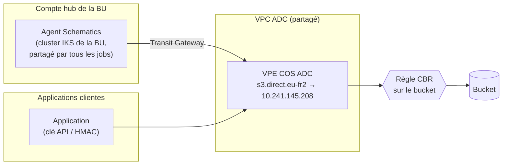
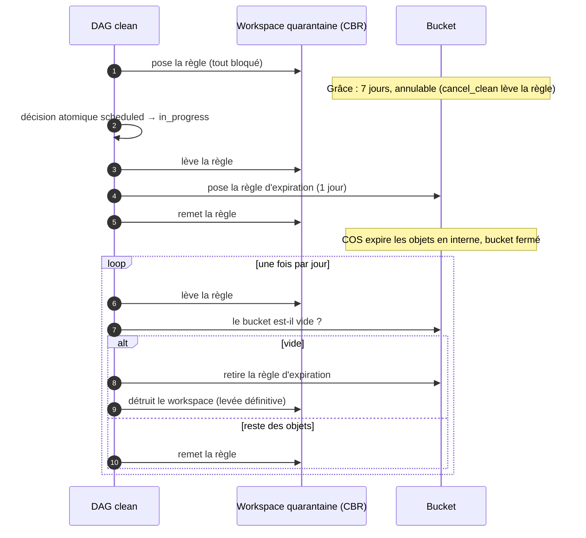

# ADR 0004 : la quarantaine ferme tout, et s'ouvre brièvement quand l'orchestrateur agit

- Statut : accepté, mise en œuvre à faire (voir « Travail restant »)
- Date : 2026-10-09
- Remplace : la décision 2 de l'ADR 0003 (zone qui laisse passer Schematics) ;
  le reste de l'ADR 0003 (grâce, annulation, décision atomique, contrôle des
  verrous) est inchangé.
- Contributeurs : équipe orchestrateur COS ; analyse réseau avec l'équipe
  réseau (Benjamin Zaehringer).

## En bref

Pendant les sept jours de grâce d'un clean, le bucket est mis en
quarantaine : plus personne n'y accède, ce qui fait apparaître une erreur de
demande tout de suite plutôt que sept jours plus tard. Nous voulions une
quarantaine sélective : le client bloqué, l'orchestrateur autorisé, pour
vider le bucket sans jamais le rouvrir. **C'est impossible avec notre réseau
actuel**, parce que l'orchestrateur et les clients entrent dans COS par la
même porte. La quarantaine ferme donc tout, et l'orchestrateur la lève
quelques minutes à chaque fois qu'il doit agir sur le bucket : poser la règle
de vidage, vérifier que le bucket est vide, le supprimer.

## L'image à retenir

Un bucket est une pièce dans un immeuble. On y entre par une porte
(l'endpoint réseau) et il faut un badge (la clé API ou HMAC).

- **IAM** contrôle le badge : qui a le droit.
- **CBR** (Context-Based Restrictions) est un gardien posté devant la pièce
  qui ne regarde pas le badge, seulement **la porte par laquelle on arrive**
  : une adresse IP, un VPC, ou un service IBM.

Pour laisser entrer l'orchestrateur et pas le client, le gardien doit les voir
arriver par deux portes différentes. Or chez nous, les jobs Terraform de
l'orchestrateur et les applications clientes arrivent par la **même porte** :
le VPE COS du VPC ADC, partagé par tout le monde. Le gardien ne peut que tout
laisser passer ou tout bloquer.

Vu du gardien, les deux flux viennent du même VPE : aucune règle ne peut les
séparer.

## Le besoin, rappel

- Un clean vide un bucket par une règle d'expiration : c'est irréversible.
- Un délai de rétractation de sept jours, annulable (`cancel_clean`).
- Pendant ce délai, le bucket inaccessible, pour qu'une demande erronée se
  voie immédiatement (l'application du client tombe en 403).
- Le vidage doit vraiment vider : si le client continue d'écrire pendant le
  vidage, un bucket alimenté en continu ne se vide jamais.

## Ce que nous avons essayé, et pourquoi chaque piste a été abandonnée

| # | Piste | Résultat | Pourquoi abandonnée |
|---|---|---|---|
| 1 | Règle qui bloque tout (zone vide, adresse 192.0.2.1), levée définitivement à la fin de la grâce, vidage bucket ouvert | Validée en INT : le bucket répond 403 pendant la quarantaine | Le client retrouve l'accès pendant tout le vidage (un à deux jours) et peut empêcher le bucket de se vider |
| 2 | Zone « référence de service Schematics » du **compte hub** | Refusée par l'API CBR | CBR n'accepte une référence de service que du compte propriétaire de la zone (`Invalid serviceRef value: account_id`), c'est-à-dire le compte workload |
| 3 | Zone « référence de service Schematics » du **compte workload** | Acceptée par CBR, mais ne laisse pas passer nos jobs | Une référence de service couvre l'infrastructure Schematics managée par IBM. Nos jobs tournent sur un **agent Schematics** installé dans le cluster IKS de la BU : leur trafic vient du réseau de ce cluster, pas du service Schematics |
| 4 | Zone « VPC de l'agent du hub » | Écartée par l'analyse réseau | Il faudrait un VPC par BU, mais surtout l'agent ne joint pas COS par un VPE à lui : `s3.direct.eu-fr2` résout vers 10.241.145.208, le VPE COS ADC, atteint par le Transit Gateway. En eu-de, les buckets non liés à un VPE passent aussi par un VPC ADC (celui de Francfort, 55.47.242.4). Autoriser le VPC ADC, c'est autoriser tous les clients |
| 5 | Surcharger le DNS de l'agent pour qu'il passe par un VPE du hub | Refusée par l'équipe réseau | L'agent est **agnostique** : il exécute les jobs de tous les produits de la BU avec le même DNS. Changer le chemin vers COS pour la quarantaine le changerait pour tous, au risque de casser des workspaces qui dépendent du chemin ADC |

### Pourquoi le DNS a tranché la question

CBR identifie un appel privé par le VPE par lequel il arrive. Le VPE utilisé
est celui vers lequel le nom de l'endpoint (`s3.direct.<région>...`) résout,
depuis la machine qui appelle. La résolution DNS faite depuis l'agent (par
l'équipe réseau, avec `curl -v` ; le module `terraform/v1.12/network_diagnostic`
permet de la refaire sans accès au cluster) dit donc directement par quelle
porte passent nos jobs : ici, la porte commune.

### Pourquoi l'agent est « agnostique »

L'agent Schematics de la BU, ce sont des pods dans son cluster IKS. Ils
prennent les jobs en file chez Schematics (plan, apply, destroy) et les
exécutent dans des conteneurs Terraform, pour tous les workspaces affectés à
l'agent : buckets, VPC, clusters, bases, et produits d'autres équipes. Tous ces
conteneurs partagent le résolveur DNS du cluster. Le DNS est un réglage du
runner, pas du job : un job ne peut pas demander son propre chemin vers COS.

## Décision

**La règle CBR de quarantaine bloque tout, et l'orchestrateur la lève
brièvement chaque fois qu'il doit agir sur le bucket, puis la remet.**

- Zone : une adresse de documentation qui ne correspond à rien (192.0.2.1,
  RFC 5737). Aucune requête ne satisfait la zone : tout est bloqué, clients,
  Airflow et Schematics.
- La règle vit toujours dans un workspace Schematics séparé du bucket
  (`ws_cbr_bucket_<subscription>`, ADR 0003) : son refresh n'appelle que l'API
  CBR, qu'une règle sur COS ne bloque jamais. Lever la règle reste donc
  toujours possible, quoi que la règle bloque.
- Une variable du workspace pose ou lève la règle sans détruire le workspace ;
  la destruction du workspace reste la levée définitive.
- La propagation d'une règle CBR prend quelques minutes : chaque réouverture
  dure le temps de la propagation, plus l'action.

### Déroulé d'un clean

Pourquoi ça suffit à garantir le vidage : l'expiration est appliquée par COS
en interne, sans passer par le réseau, donc la règle CBR ne la gêne pas. Ce
qu'un client écrirait pendant une réouverture de quelques minutes a plus d'un
jour au passage suivant de l'expiration, et part aussi.

### Annulation (`cancel_clean`)

Inchangée : acceptée tant que la décision n'est pas prise, elle détruit le
workspace de quarantaine, ce qui rend l'accès.

### Suppression du bucket (`delete`)

La suppression passe par Schematics et par l'API COS : elle serait bloquée
par la règle. Le DAG `delete` lève donc la quarantaine **avant** de détruire le
bucket (aujourd'hui il la lève après). Le bucket disparaît ensuite : pas de
règle à remettre.

### Test (`quarantine_test`)

Pose la règle, vérifie le 403 depuis Airflow, la lève, vérifie le retour du
200. Il mesure aussi les délais de propagation, qui fixent la durée des
réouvertures. À ajouter : pendant le blocage, appeler l'API de configuration
COS (`object_count`). Si la règle CBR ne la bloque pas, le contrôle quotidien
du vidage se fait bucket fermé, et il ne reste qu'une réouverture, à la fin de
la grâce. La documentation IBM ne le dit pas : le test le dira.

## Conséquences

- Le client voit des 403 pendant toute la grâce et tout le vidage, avec des
  éclaircies de quelques minutes. Ce qu'il écrit pendant ces éclaircies est
  détruit : la notice du state (`clean_notice`) le dit.
- Un échec pendant une réouverture laisse le bucket du côté sûr : si la remise
  échoue, le bucket reste ouvert et le clean passe en `failed` avec une alerte ;
  si la levée échoue, il reste fermé. `cancel_clean` et la sortie de secours
  (`ibmcloud cbr rule-delete <id>`, identifiant en sortie du workspace) restent
  disponibles.
- Les services qui lisent le bucket en interne (backup) sont bloqués pendant la
  grâce et le vidage, comme le client.
- Le nombre de règles CBR par compte est plafonné : une par bucket en
  quarantaine, toujours retirée à la fin.
- L'architecture est la même dans toutes les régions : elle ne dépend pas du
  chemin réseau.

## Alternatives écartées

- **Quarantaine par IAM** (retirer les politiques des Service IDs clients
  pendant la grâce, puis les restaurer) : elle séparerait bien l'orchestrateur
  des clients, mais la clé d'instance COS donne accès à tous les buckets de
  l'instance (la retirer coupe les autres buckets du client), les accès humains
  par la console resteraient ouverts, et restaurer des politiques à l'identique
  est fragile.
- **Règle d'expiration datée à J+7, posée dès la demande** : si l'annulation
  échoue à J+6, COS détruit quand même (ADR 0003).
- **Zones CBR par référence de service ou par VPC** : voir le tableau
  ci-dessus.

## Piste future : un agent Schematics dédié à l'orchestrateur

La quarantaine sélective redevient possible si l'orchestrateur a **sa propre
porte** vers COS. C'est un chantier d'infrastructure, pas de code :

1. un agent Schematics dédié aux workspaces de l'orchestrateur, dans un VPC du
   compte hub ;
2. un VPE COS dans ce VPC, et une zone DNS privée qui fait résoudre
   `s3.direct.<région>...` vers ce VPE, pour ce VPC seulement ;
3. l'affectation des workspaces de l'orchestrateur (buckets, quarantaine) à cet
   agent.

Le DNS étant propre à cet agent, il ne touche aucun autre produit, ce qui lève
l'objection de la piste 5. La zone CBR devient alors « le VPC de l'agent
orchestrateur » : le client est bloqué, l'orchestrateur passe, et plus aucune
réouverture n'est nécessaire. Le module de quarantaine n'a qu'à changer
l'adresse de sa zone (`type = "vpc"`).

À instruire avec l'équipe réseau et l'équipe plateforme : coût d'un agent et
d'un VPE par région, exploitation de l'agent, et un VPC par BU ou un seul hub
orchestrateur.

## Écueils techniques rencontrés en INT

Pour ne pas les retrouver : chacun a coûté un passage en INT.

| Symptôme | Cause | Correction |
|---|---|---|
| `module.vault ... no attribute "secret"` | La sortie du module Vault de lecture s'appelle `secrets`, la clé `api_key` | `module.vault.secrets["api_key"]` |
| `The argument "account_id" is required` sur `ibm_cbr_zone` | Le compte de la zone est obligatoire (provider IBM 1.89) | Compte workload du realm (`wklapp_account_id`) |
| `Unable to open Endpoints File` | `endpoints_file_path` vers un fichier absent du module | Chemin conditionnel (`fileexists`) |
| `Post https://cbr.cloud.ibm.com/v1/zones: context deadline exceeded` | L'agent ne joint pas l'endpoint public de CBR | Entrée `IBMCLOUD_CONTEXT_BASED_RESTRICTIONS_ENDPOINT` vers `private.cbr.cloud.ibm.com` dans `ibm_endpoints.json` (attention à l'orthographe : une clé `CONTEXTE_` est ignorée sans erreur) |
| `No value for required variable` après l'ajout d'une variable | Le workspace retrouvé par son nom gardait ses anciennes variables | Le service réécrit le jeu complet de variables avant chaque run |
| `realm has no hub_account_id` | Le modèle du reader préfixe les comptes : `buhub_account_id`, `wklapp_account_id` | Lecture des noms exacts du `model_dump()` |

## Travail restant

- Module `terraform/v1.12/bucket_quarantine` : zone revenue à l'adresse
  192.0.2.1 ; retrait de la référence de service, de la sonde (`probe.tf`) et
  du provider `http` ; variable pour poser ou lever la règle sans détruire le
  workspace.
- `quarantine_service` : retrait de `buhub_account_id` et de
  `probe_bucket_via_schematics` ; `set` et `lift` deviennent « poser / lever la
  règle », la destruction du workspace reste la levée définitive.
- DAG `clean` : le cycle levée, action, remise à la fin de la grâce et pour
  chaque contrôle du vidage.
- DAG `delete` : lever la quarantaine avant de détruire le bucket.
- DAG `quarantine_test` : retrait de l'étape Schematics, ajout de l'appel à
  l'API de configuration pendant le blocage.
- `terraform/v1.12/network_diagnostic` : gardé pour vérifier le chemin réseau
  d'une autre région ou d'un futur agent dédié.
