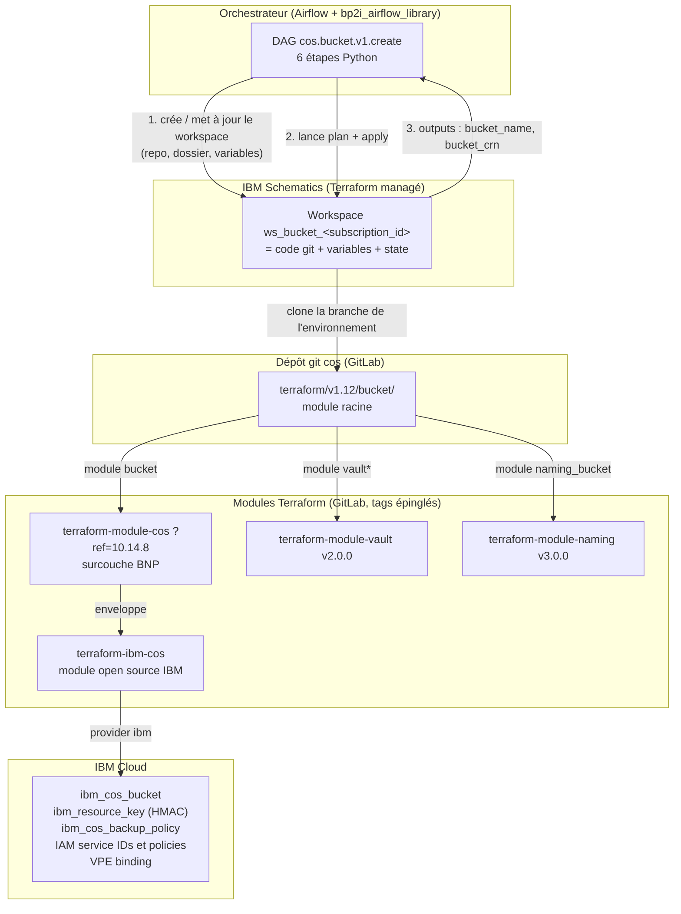
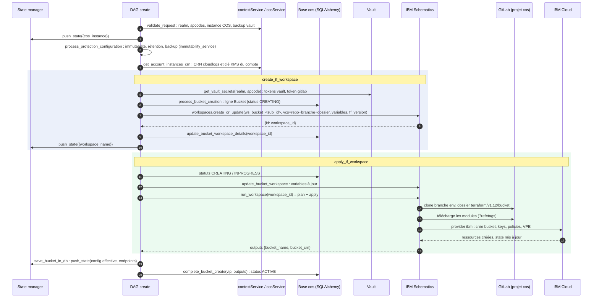
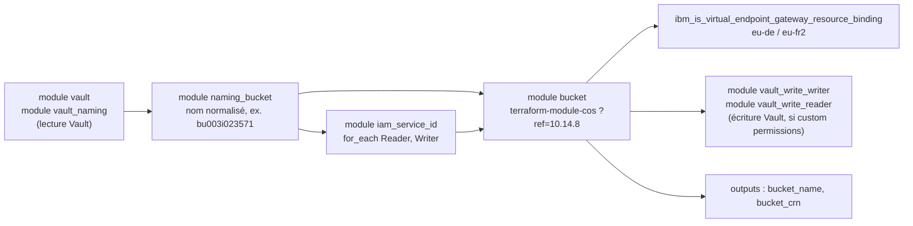
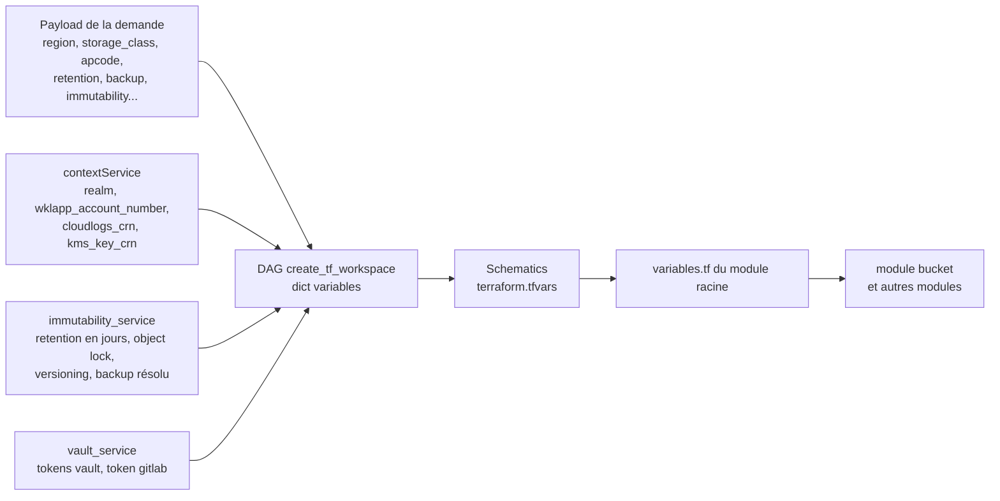
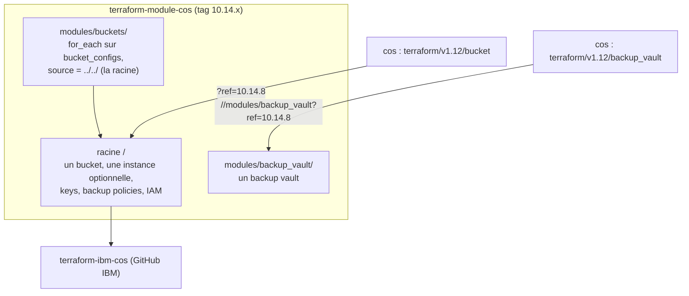
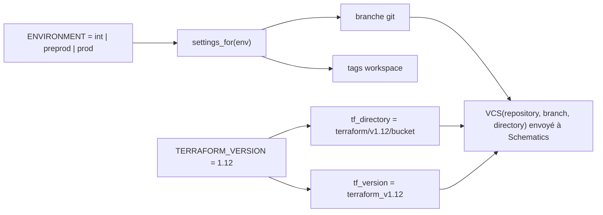

# Terraform dans le projet `cos` : comment un bucket est réellement créé

Ce document explique la chaîne complète entre une demande de bucket reçue par
l'orchestrateur et les ressources créées chez IBM Cloud : qui exécute
Terraform, où vit le code, comment les modules s'emboîtent, d'où viennent les
variables et où regarder quand quelque chose casse.

Il s'appuie sur `terraform/v1.12/bucket/main.tf`, sur les DAGs
`cos_service/dags/bucket/v1/` et sur `cos_service/services/schematics_service.py`.

---

## 1. Vue d'ensemble : quatre étages

Le projet `cos` ne parle jamais directement à l'API IBM Cloud Object Storage.
Il écrit du Terraform, et il délègue son exécution à **IBM Schematics**, le
service Terraform managé d'IBM Cloud. Chaque bucket a son propre *workspace*
Schematics, qui garde l'état Terraform (`terraform.tfstate`) de ce bucket.



À retenir :

| Étage | Rôle | Où le modifier |
|---|---|---|
| DAG Python | Valide la demande, calcule les variables, pilote Schematics, enregistre le résultat en base | `cos_service/dags/bucket/v1/*.py` |
| Module racine | Assemble les modules pour **un** bucket, expose les outputs | `terraform/v1.12/bucket/` |
| `terraform-module-cos` | Surcouche BNP du module IBM : contournements, conventions, sous-modules `buckets` et `backup_vault` | Dépôt GitLab `orchestrator/terraform/modules/terraform-module-cos`, changer le `?ref=` ici |
| `terraform-ibm-cos` | Module open source IBM, crée les ressources via le provider `ibm` | Dépendance du précédent, jamais touché depuis `cos` |

---

## 2. Le chemin d'une demande de création

Diagramme de séquence des six étapes du DAG `cos.bucket.v1.create`. Les
services en gris sont ceux que les tests unitaires remplacent par des mocks.



En cas d'échec dans `create_tf_workspace` ou `apply_tf_workspace`, le DAG
passe le bucket en `LOCKED` et son workspace en `FAILED`, puis relève
l'exception. Le workspace Schematics reste en place avec son state : un
`retry` de la demande réutilise le même workspace (`get_bucket_by_sub_id`
retrouve `workspace_id`), Terraform reprend là où il s'est arrêté.

---

## 3. Anatomie de `terraform/v1.12/bucket/main.tf`

Le module racine ne crée presque aucune ressource lui-même : il **assemble**.
Voici ses blocs dans l'ordre de dépendance réel, qui n'est pas l'ordre du
fichier.



| Bloc | Ce qu'il fait | Source | Conditionnel |
|---|---|---|---|
| `module "vault"`, `module "vault_naming"` | Lisent dans le Vault BNP la clé API du compte IBM et le secret de nommage | `terraform-module-vault.git//read?ref=v2.0.0` | non |
| `module "naming_bucket"` | Calcule le nom du bucket selon la convention BNP (métier, type de cloud, service `bu`, provider `i`) | `terraform-module-naming.git//paas?ref=v3.0.0` | non |
| `module "iam_service_id"` | Deux Service IDs, Reader et Writer, chacun avec une policy limitée à ce bucket | dossier local `../modules/terraform-ibm-iam-service-id-main` | non |
| `module "bucket"` | Le bucket lui-même, ses clés HMAC, ses backup policies | `terraform-module-cos.git?ref=10.14.8` | non |
| `data` + `resource` VPE | Rattache le bucket à la passerelle privée `vpe-cos` | provider `ibm` | `eu-de` ou `eu-fr2`, voir §7 |
| `module "vault_write_*"` | Écrivent les credentials HMAC dans le Vault de l'application | `terraform-module-vault.git//write?ref=v2.0.0` | `enable_custom_permissions` |

Un point structurant : **le nom du bucket n'est connu qu'à l'apply**, car il
sort du module de naming. Tout ce qui doit être décidé au `plan`, notamment
les clés d'un `for_each`, ne peut pas en dépendre. C'est pour cela que la clé
des `backup_policies` est `bp-<jours>d` et non `<bucket>-bp-<jours>d`.

---

## 4. D'où viennent les variables

Le DAG construit le dictionnaire `variables` dans `create_tf_workspace` et le
transmet à Schematics, qui le convertit en `terraform.tfvars`. Chaque entrée
correspond à un `variable` de `terraform/v1.12/bucket/variables.tf`.



| Variable envoyée par le DAG | Origine | Utilisée dans `main.tf` par |
|---|---|---|
| `region`, `bucket_storage_class`, `app_code`, `enable_custom_permissions` | payload | `module.bucket`, VPE, Vault write |
| `cos_instance_crn`, `cos_instance_name` | instance COS validée | `module.bucket.existing_cos_instance_id`, chemin Vault |
| `kms_key_crn` | `get_account_instances_crn` | `module.bucket.kms_key_crn` |
| `activity_tracker_crn`, `sysdig_crn` | `get_account_instances_crn` | **rien : lignes commentées dans `module.bucket`** |
| `management_endpoint_type_for_bucket` = `direct` | constante du DAG | `module.bucket` |
| `vault_read_token`, `vault_read_addr`, `vault_write_token`, `vault_write_addr` | `get_vault_secrets` | providers `vault.read` / `vault.write` |
| `orchestrator_environment` | `bp2i_airflow_library.config.ENVIRONMENT` | chemins Vault, tags |
| `wklapp_account_id` | realm | `module.bucket` / naming |
| `retention` (objet), `object_locking_enabled`, `object_versioning_enabled`, `object_lock_duration_days` / `_years` | `immutability_service` | `module.bucket` |
| `backup_enabled`, `target_backup_vault_crn`, `initial_delete_after_days` | `immutability_service` + backup vault validé | `module.bucket.backup_policies` |
| `cloud_type` = `3` si `eu-de`, sinon `2` | DAG | `module.naming_bucket.cloud_type` |

Les tokens sont passés comme `TerraformVar(valeur, sensitive=True)` : Schematics
les stocke chiffrés et ne les affiche jamais dans les logs.

---

## 5. Le dépôt `terraform-module-cos`

C'est la **surcouche BNP** du module open source
[`terraform-ibm-modules/terraform-ibm-cos`](https://github.com/terraform-ibm-modules/terraform-ibm-cos).
Il expose trois points d'entrée :



- **La racine** est ce que `cos` appelle pour un bucket. Elle prend
  `bucket_name`, `existing_cos_instance_id`, `retention_*`, `object_lock_*`,
  `resource_keys`, `backup_policies`.
- **`modules/buckets/`** boucle avec `for_each` sur une liste
  `bucket_configs` et rappelle la racine une fois par bucket. C'est un confort
  pour créer plusieurs buckets dans un seul apply. `cos` ne l'utilise pas :
  un workspace par bucket, la boucle est faite par l'orchestrateur, une
  demande à la fois.
- **`modules/backup_vault/`** est utilisé par `terraform/v1.12/backup_vault`.

Le `time_sleep.wait_for_authorization_policy` de 30 secondes, avec le
commentaire « workaround for terraform-ibm-cos issue 672 », illustre le rôle
de la surcouche : IBM met quelques secondes à propager une politique
d'autorisation IAM, et sans cette pause la création du bucket échoue par
intermittence. Le module BNP absorbe ce genre de détail pour que `cos` n'ait
pas à le connaître.

**Épinglage des versions.** `?ref=10.14.8` fige le code téléchargé. Changer
ce tag change le comportement de tous les buckets créés ou mis à jour ensuite,
sans aucune modification Python. La ligne commentée
`#source = "../modules/terraform-module-cos"` sert au développement local :
on clone le module à côté et on le modifie sans publier de tag.

---

## 6. Versions, branches et environnements

**Version de Terraform.** Les dossiers `v1.5`, `v1.9`, `v1.12` correspondent
aux versions de Terraform demandées à Schematics. La source unique est
`schematics_service.TERRAFORM_VERSION = "1.12"`, dont dérivent le dossier
`terraform/v1.12/bucket` et le label `terraform_v1.12` envoyé au workspace.
Les anciens dossiers restent pour les workspaces existants créés avec eux.

**Branche git par environnement.** Schematics clone toujours le dépôt `cos`
lui-même, sur une branche qui dépend de l'environnement de l'orchestrateur :

| Environnement | Branche clonée par Schematics | Tags du workspace |
|---|---|---|
| `int` | `COS_TF_INT_BRANCH`, défaut `feature/update-retention-to-5-years` | `env:int` |
| `preprod` | `preprod` | `env:pprod` |
| `prod` | `prod` | `env:prod` |

Conséquence importante : **le Terraform exécuté est celui de la branche, pas
celui du poste**. Une modification de `main.tf` non poussée sur la branche de
l'environnement n'est jamais exécutée. Et un `git push` sur `prod` change
immédiatement ce que le prochain apply fera.



---

## 7. Points d'attention relevés dans `v1.12/bucket/main.tf`

- **Le cycle de vie des objets est débranché.** `archive_days = null`,
  `expire_days = null`, et `#expire_days = var.expire_days`,
  `#monitoring_crn`, `#activity_tracker_crn` sont commentés. Le DAG envoie
  pourtant `activity_tracker_crn` et `sysdig_crn` : ces variables arrivent à
  Schematics et ne servent à rien. Brancher les règles de cycle de vie passe
  par ces lignes et par le module.
- **Priorité des opérateurs dans la condition du VPE.**
  `var.region == "eu-de" || var.region == "eu-fr2" && (VITAL...)` : `&&`
  est évalué avant `||`. La condition se lit « eu-de dans tous les cas, ou
  eu-fr2 seulement si le compte est VITAL ». Si l'intention est « eu-de ou
  eu-fr2, et VITAL dans les deux cas », il manque des parenthèses autour du
  `||`. À trancher avec l'auteur avant de toucher.
- **`skip_iam_authorization_policy = true`** : la politique d'autorisation
  KMS est créée ailleurs, comme le commentaire l'indique. La retirer créerait
  un doublon.
- **`hard_quota = 0`** : pas de quota. C'est un choix, pas un oubli.
- **Clé du `for_each` des backup policies** : ne jamais y remettre le nom du
  bucket, voir §3.
- **`add_bucket_name_suffix = false`** : le nom vient entièrement du module
  de naming, le module IBM ne doit pas y ajouter de suffixe aléatoire.

---

## 8. Faire évoluer cette partie

**Monter de version le module BNP.** Changer `?ref=10.14.8` dans
`module "bucket"` et dans `terraform/v1.12/backup_vault/main.tf`, lire le
changelog du tag, vérifier les variables ajoutées ou renommées, pousser sur
la branche de l'INT, créer un bucket de test.

**Ajouter une variable de bout en bout.** Trois endroits, dans cet ordre :

1. `terraform/v1.12/bucket/variables.tf` : déclarer la variable, avec un
   `default` si les workspaces existants ne doivent pas casser à leur
   prochain apply.
2. `terraform/v1.12/bucket/main.tf` : la transmettre au module concerné.
3. `cos_service/dags/bucket/v1/cos.bucket.v1.create.py`, étape
   `create_tf_workspace`, et `workspaceService.build_bucket_workspace_details`
   pour l'update : l'ajouter au dictionnaire `variables`.

Puis un test unitaire dans `tests/dags/test_bucket_create.py`, classe
`TestCreateTfWorkspace`, qui vérifie que la variable est envoyée avec la bonne
valeur : c'est le seul endroit où l'écart entre Python et Terraform est
détectable sans lancer Schematics.

**Vérifier le Terraform sans Schematics.** Depuis `terraform/v1.12/bucket` :

```bash
terraform init -backend=false     # télécharge providers et modules, sans state
terraform validate                # syntaxe, types, variables manquantes
terraform fmt -check              # formatage
```

`init` a besoin d'accéder à GitLab pour les modules (`git::https://...`) et au
registre Terraform pour le provider `ibm`, donc au proxy et au certificat
interne. Un `plan` complet exige en plus une clé API IBM et un accès au Vault,
il se fait via Schematics en INT.

---

## 9. Glossaire

- **Schematics** : service IBM Cloud qui exécute Terraform pour vous. Un
  *workspace* = un dépôt git + un dossier + des variables + un state.
- **Workspace** : ici, un par bucket, nommé `ws_bucket_<subscription_id>`,
  dans le projet Schematics `rg-realms`.
- **State** : le fichier où Terraform note ce qu'il a créé. Perdu ou
  divergent, Terraform recrée ou détruit. Il vit dans Schematics, jamais sur
  un poste.
- **Module racine** : le dossier que Terraform exécute. Il appelle des
  modules enfants.
- **`?ref=`** : la version d'un module git, tag ou branche. Toujours un tag en
  production.
- **Provider `ibm`** : le plugin Terraform qui traduit `ibm_cos_bucket` en
  appels à l'API IBM Cloud.
- **CRN** : identifiant unique d'une ressource IBM Cloud, ex.
  `crn:v1:bluemix:public:cloud-object-storage:global:a/...:bucket:...`.
- **VPE** : Virtual Private Endpoint, l'accès privé au service COS depuis le
  VPC, sans passer par Internet.
- **HMAC** : paire access key / secret key compatible S3, générée par une
  `resource_key` et stockée dans le Vault.
